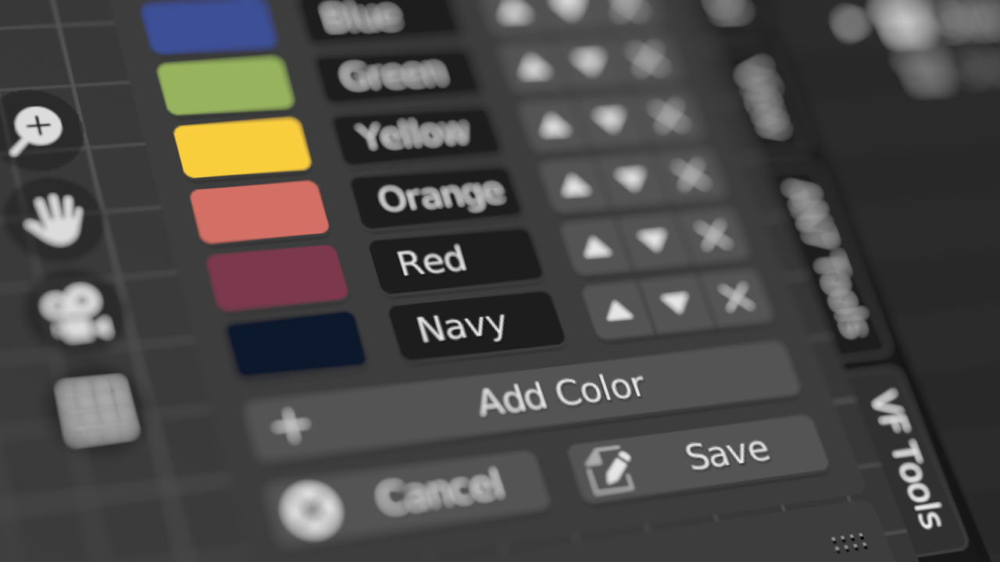

# VF Color Palette

Blender add-on to create and store colors in plain text file that's easily shared across projects and systems.

## Installation

- Download the plugin python file: [VF_colorPalette.py](https://raw.githubusercontent.com/jeinselenVF/VF-BlenderColorPalette/main/VF_colorPalette.py)
- Open Blender Preferences and navigate to the "Add-ons" tab
- Install and enable the add-on
- The color palette panel will appear in 3D views under the `VF Tools` tab

## Notes

- This add-on is provided as-is with no warranty or guarantee regarding suitability, security, safety, or otherwise. Use at your own risk.
